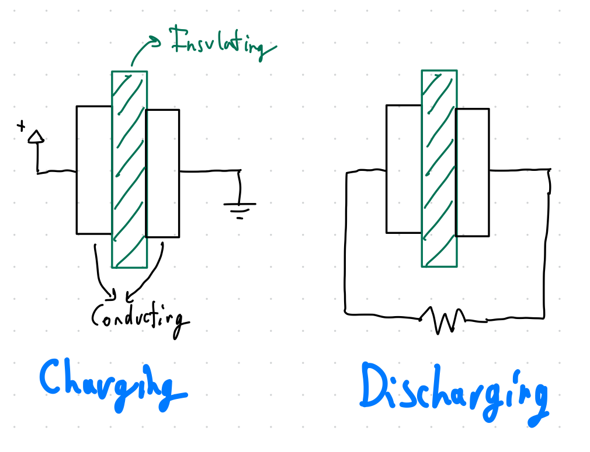
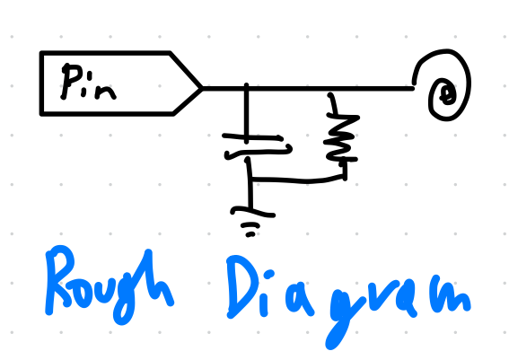

# Captouch
I created Captouch to learn how capacitive touch sensors work. It's not very complicated by design as it's just meant to be a technology proof of concept.

## How capacitive touch sensors work

### Capacitor overview
At a fundamental level, capacitive touch sensors depend on the fact that capacitors take time to discharge. A basic capacitor requires a insulating material sandwiched by 2 electrodes. A capacitor will charge when a voltage is applied across it and will discharge when there's a clear electrical path between its terminal nodes and its output voltage is above the voltage across it.



### Capacitor discharge behavior
Capacitors store charge (Coulombs `Q=CV`) and calculating the time it'll take for a capacitor to discharge requires knowing the its rate of discharge. Fortunately, current (Amps or Coulombs / second) is a measure of charge flow rate. Therefore, if the current output of a capacitor is known the instantaneous rate of discharge for the capacitor is known and if the total charge stored in the capacitor is known, that can be used to calculate the time it'll take to discharge the capacitor.

By putting a resistor in between a capacitors terminals, the equation `V=IR` can be used to calculate the output current of the capacitor based on the output voltage and resistance between the capacitors terminals. These formulas can be combined to calculate the time it'll take for a capacitor to discharge. It's critical to keep in mind that current isn't constant since as current flows out of the capacitor, the capacitor's charge decreases causing its voltage to decrease causing the output current to decrease. The final equation for the time it takes the capacitor to discharge takes the form `t = CR * ln(v_i/v_f)`.

### Sensor logic
Since it takes time for a capacitor to discharge, a circuit can be setup to repeatedly charge and discharge a capacitor and measure the time it takes to discharge. The time it takes to discharge should remain constant since the fully charged voltage, final voltage, capacitance, and resistence of the system are known and constant. A half-capacitor (just 1 electrode and the dielectric) can be added to the circuit and this'll have no effect on the time it takes to discharge since a half-capacitor stores no charge. However, when a conductive object (for example, a finger) comes in contact with the dielectric the half-capacitor turns into a normal capacitor and stores some charge. On the next charge/discharge cycle, the full charged system of two capacitors will take longer to discharge due to the extra capacitance in the system. This change in the time it takes can be measured to indicate when a conductive object has come into contact with the dielectric surface.

### Rough circuit diagram


### Code overview
This is not going to be a line by line explanation of the code, just an overview of what's going on.

**Capacitor Charging and Discharging:**
The code uses an ESP32 pin to charge a capacitor and as a sensor by setting the pin to `HIGH` and then switches it to an input mode to measure how long it takes for the capacitor to discharge.
The presence of a conductive object increases the discharge time, which the program measures.

```c
pinMode(SENSOR, OUTPUT);
digitalWrite(SENSOR, HIGH);
wait();

pinMode(SENSOR, INPUT);

int ticks = 0;
while (digitalRead(SENSOR) == HIGH) {
    ticks++;
}
```

**Smoothing Measurements:**
The code uses a buffer to average multiple discharge time measurements, smoothing out noise and providing a more stable reading.

```c
int buffer[BUFF_LEN] = {0};

void push_to_buffer(int value) {
    for (int i = 1; i < BUFF_LEN; i++) {
        buffer[i - 1] = buffer[i];
    }
    buffer[BUFF_LEN - 1] = value;
}

int avg_value() {
    int total = 0;
    for (int i = 0; i < BUFF_LEN; i++) {
        total += buffer[i];
    }
    return total / BUFF_LEN;
}
```

**Calibration and Detection:**
Initially, the system calibrates itself by measuring the average discharge time without any touch (baseline). In the detection phase, it continuously measures and compares the discharge time to the baseline. If the discharge time exceeds the baseline by a defined `THRESHOLD`, it indicates a touch by turning on an LED.

```c
int state = 0;
int base_discharge_time = 0;

void loop() {
    if (state == 0) {
        for (int i = 0; i < BUFF_LEN; i++) {
            base_discharge_time = measure_cap_delay();
            delay(5);
        }
        state = 1;
    } else if (state == 1) {
        int discharge_time = measure_cap_delay();
        if (discharge_time > base_discharge_time + THRESHOLD) {
            digitalWrite(LED, HIGH);
        } else {
            digitalWrite(LED, LOW);
        }
        delay(5);
    }
}
```

**Threshold Adjustment:**
The `THRESHOLD` value is crucial for distinguishing between touch and no-touch states. It must be adjusted based on the specific hardware setup and environment.

```c
#define THRESHOLD 3
```